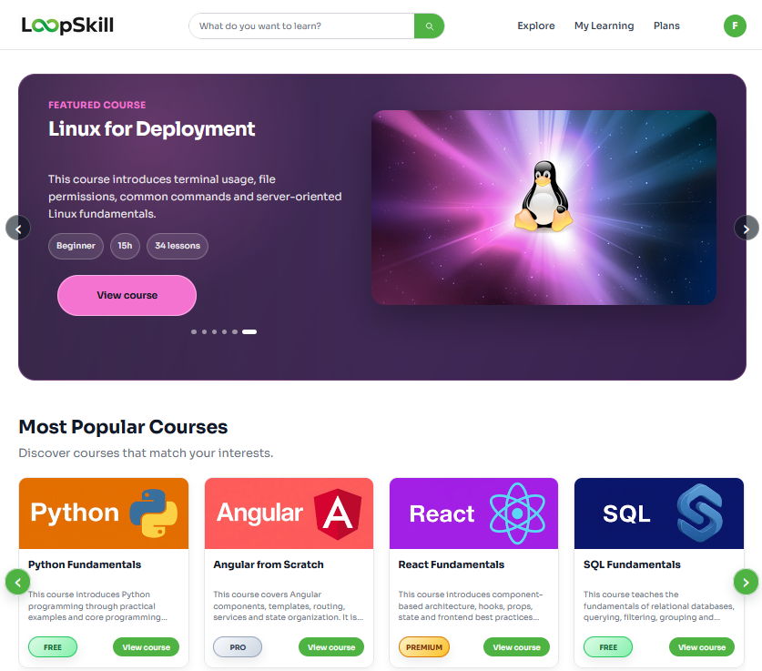
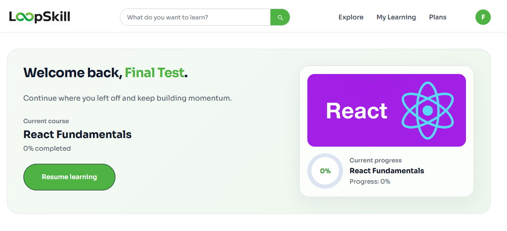
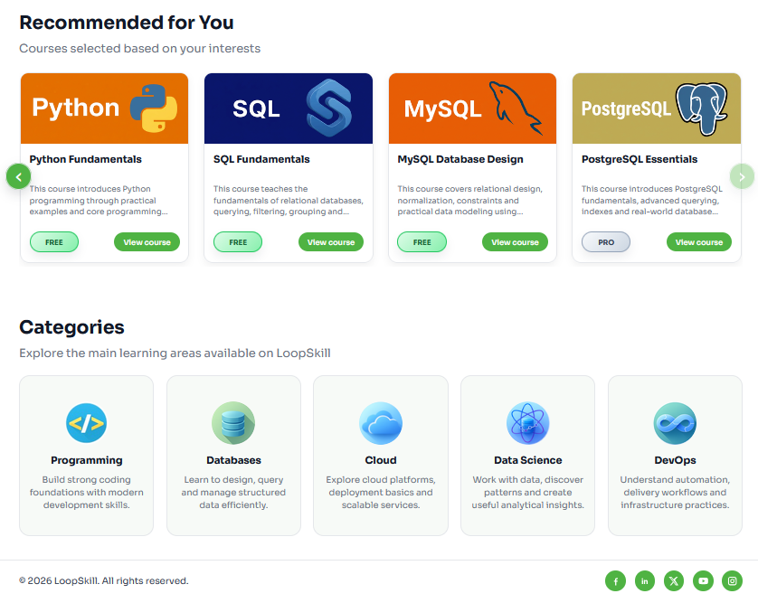
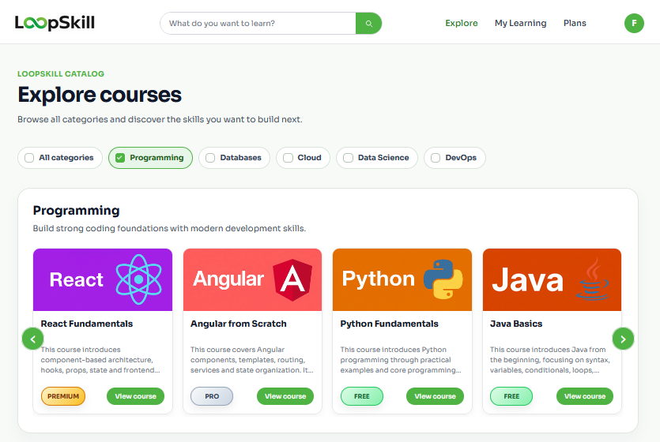
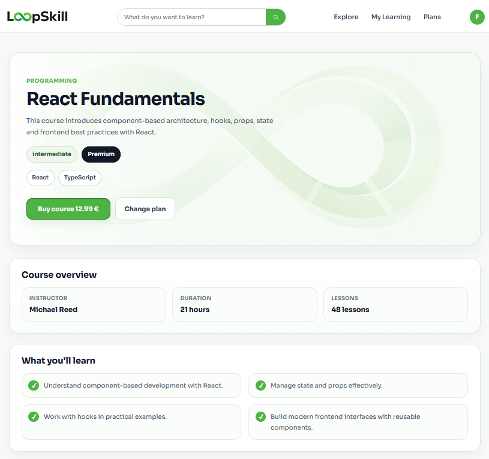
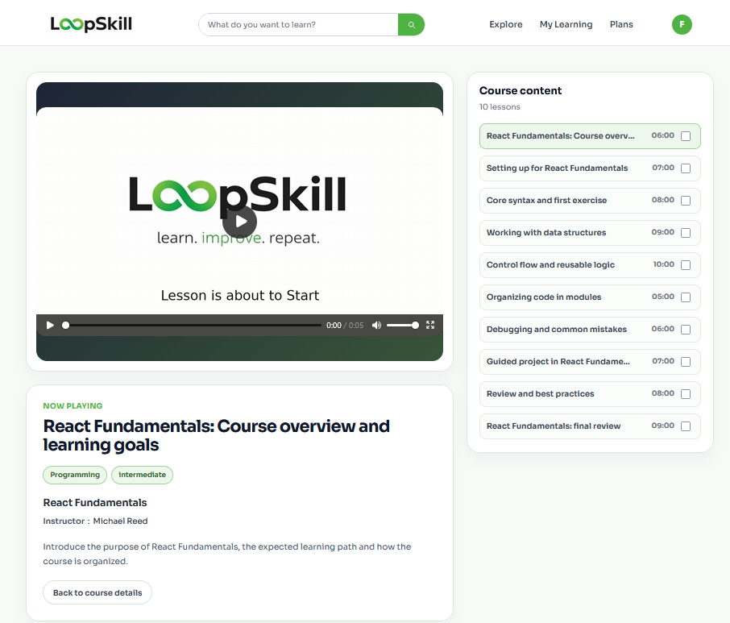
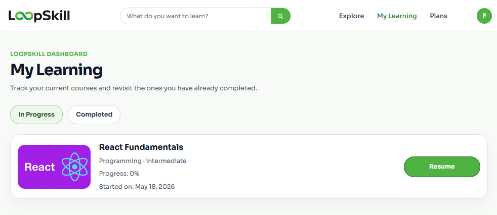
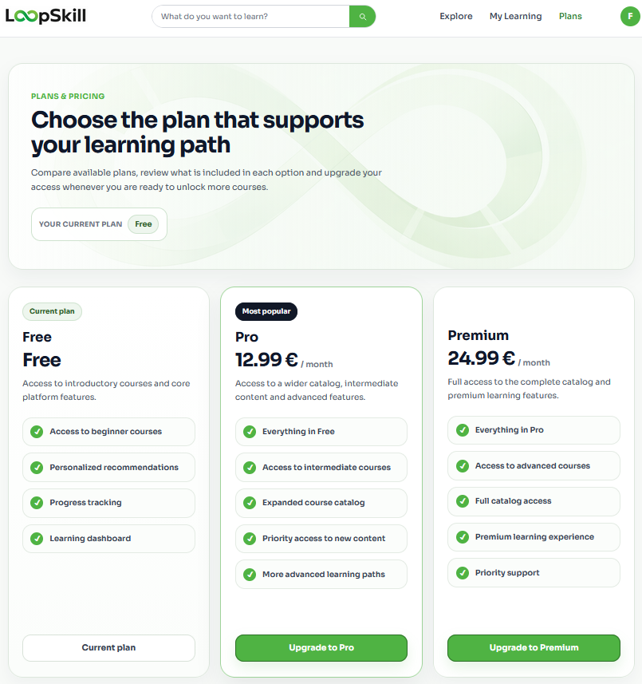
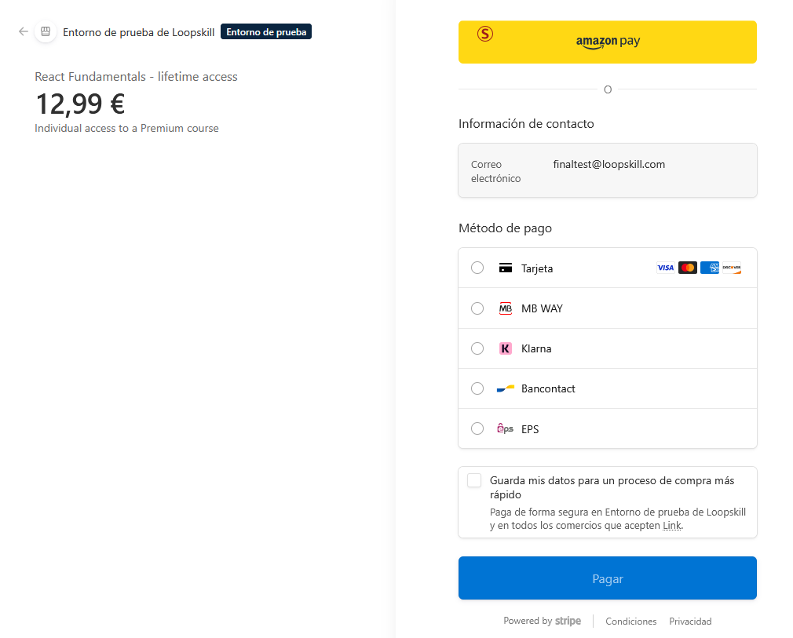
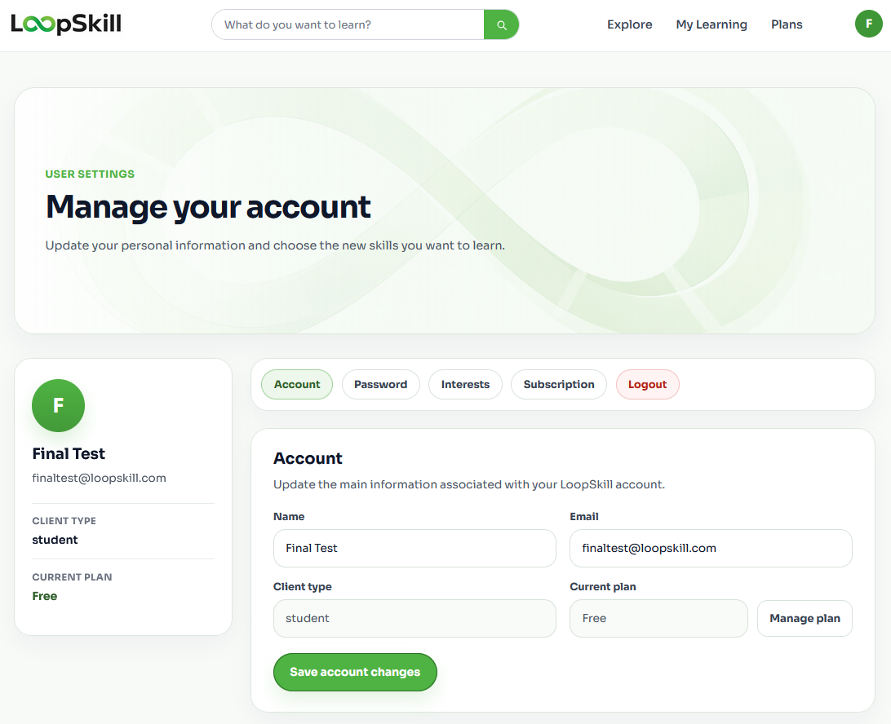

<div align="center">

<br/>


**Plataforma MOOC full stack con recomendaciones, control de acceso por planes y pagos en modo test**

<br/>


<br/>

> Proyecto de Fin de Grado - Desarrollo de Aplicaciones Web - 2025-2026

</div>

---

## Que es LoopSkill

LoopSkill es una plataforma de formacion online desarrollada como TFG del ciclo de Desarrollo de Aplicaciones Web. El objetivo es ofrecer una experiencia MOOC clara y personalizada, con catalogo de cursos tecnicos, recomendaciones basadas en intereses, seguimiento de progreso, acceso por planes y compras gestionadas mediante Stripe Checkout en modo test.

El proyecto ya funciona como aplicacion full stack: **Angular** en el frontend, **Node.js con Express** en el backend y **MySQL/MariaDB** como base de datos relacional. La version actual sustituye el prototipo mock inicial por servicios HTTP reales, autenticacion JWT y persistencia en base de datos.

---

## Estado del proyecto

| Modulo | Estado |
|---|---|
| Registro, login y sesion JWT | Completado |
| Onboarding y gestion de intereses | Completado |
| Home personalizada | Completado |
| Exploracion de cursos por categoria, nivel, tags y busqueda | Completado |
| Detalle de curso con resultados, lecciones y reglas de acceso | Completado |
| Reproductor de curso y actualizacion de progreso | Completado |
| My Learning: cursos en progreso y completados | Completado |
| Planes Free, Pro y Premium | Completado |
| Stripe Checkout para planes y compras individuales | Completado en modo test |
| Cancelacion de suscripcion | Completado |
| Settings de perfil, contrasena, intereses y suscripcion | Completado |
| Panel admin con CRUD de cursos | Completado |
| API REST y coleccion Postman | Completado |
| Despliegue frontend/backend | Documentado; demo online no activa actualmente |

---

## Capturas de pantalla

### Home y recomendaciones

| Home principal | Progreso actual |
|---|---|
|  |  |

| Recomendaciones y categorias |
|---|
|  |

### Catalogo y aprendizaje

| Exploracion de cursos | Detalle de curso |
|---|---|
|  |  |

| Reproductor de lecciones | My Learning |
|---|---|
|  |  |

### Planes, pagos y cuenta

| Planes | Stripe Checkout |
|---|---|
|  |  |

| Ajustes de usuario |
|---|
|  |

---

## Funcionalidades principales

**Usuario**
- Registro e inicio de sesion con token JWT.
- Seleccion inicial de intereses para personalizar recomendaciones.
- Catalogo de cursos tecnicos organizado por categorias, niveles y etiquetas.
- Home dinamica con cursos populares, recomendaciones y progreso actual.
- Detalle de curso con plan requerido, objetivos de aprendizaje y acceso a lecciones.
- Matriculacion, seguimiento de progreso y vista de cursos completados.
- Gestion de perfil, cambio de contrasena, intereses y suscripcion.
- Mejora de plan o compra individual de cursos mediante Stripe Checkout.

**Administrador**
- Acceso protegido por rol `admin`.
- Listado completo del catalogo.
- Creacion, edicion y eliminacion de cursos.
- Gestion de categoria, nivel, plan requerido, precio, instructor, imagen, horas estimadas y tags.
- Validacion backend de payloads, relaciones y duplicados.

**Pagos y acceso**
- Los cambios directos de plan estan bloqueados desde la API.
- Las subidas a Pro/Premium pasan por Stripe Checkout.
- Los cursos pueden desbloquearse por plan contratado o por compra individual.
- Los webhooks de Stripe registran pedidos pagados, compras de cursos y suscripciones.

---

## Stack tecnologico

**Frontend**
- Angular 17 con arquitectura standalone.
- TypeScript, RxJS, Angular Router y SCSS.
- Servicios HTTP tipados para auth, cursos, inscripciones y pagos.
- Persistencia local solo para token y usuario autenticado.
- Build estatico preparado para Cloudflare mediante `wrangler.jsonc`.

**Backend**
- Node.js, Express 5 y CommonJS.
- MySQL/MariaDB con `mysql2/promise`.
- JWT para autenticacion y autorizacion por roles.
- bcrypt para hash de contrasenas.
- Stripe Checkout y webhooks en modo test.
- CORS configurable por entorno.

**Base de datos**
- Esquema relacional en `database/mooc_db_v4.sql`.
- Migraciones adicionales en `database/migrations`.
- Tablas para usuarios, planes, categorias, cursos, lecciones, outcomes, tags, intereses, inscripciones, pedidos de pago, compras individuales y suscripciones.

**Documentacion y pruebas manuales**
- Estado de API: `docs/backend-api-status.md`.
- Guia de despliegue AWS: `docs/aws-deployment-guide.md`.
- Coleccion Postman: `docs/api/loopskill-backend.postman_collection.json`.

---

## Estructura del repositorio

```text
loopskill-mooc-platform/
|-- backend/
|   |-- app.js
|   |-- server.js
|   |-- config/
|   |-- controllers/
|   |-- middleware/
|   |-- routes/
|   `-- utils/
|-- database/
|   |-- mooc_db_v4.sql
|   `-- migrations/
|-- docs/
|   |-- api/
|   |-- aws-deployment-guide.md
|   `-- backend-api-status.md
`-- frontend/
    `-- app/
        |-- src/
        |   |-- app/
        |   |   |-- core/
        |   |   |-- features/
        |   |   `-- shared/
        |   |-- assets/
        |   `-- environments/
        `-- wrangler.jsonc
```

---

## API REST

La API se sirve bajo `/api`.

| Area | Endpoints principales |
|---|---|
| Health | `GET /api/health` |
| Auth | `POST /api/auth/register`, `POST /api/auth/login`, `GET /api/auth/me`, `GET /api/auth/settings`, `GET /api/auth/tags` |
| Perfil | `PATCH /api/auth/profile`, `PATCH /api/auth/password`, `PATCH /api/auth/interests` |
| Planes | `GET /api/plans` |
| Cursos | `GET /api/courses`, `GET /api/courses/categories`, `GET /api/courses/popular`, `GET /api/courses/recommended`, `GET /api/courses/:id`, `GET /api/courses/:id/lessons` |
| Inscripciones | `POST /api/enrollments`, `GET /api/enrollments/me`, `GET /api/enrollments/me/in-progress`, `GET /api/enrollments/me/completed`, `PATCH /api/enrollments/:courseId/progress` |
| Pagos | `POST /api/payments/checkout`, `POST /api/payments/subscription/cancel`, `POST /api/payments/webhook` |
| Admin | `GET/POST/PATCH/DELETE /api/admin/courses`, `GET /api/admin/categories`, `GET /api/admin/tags` |

La coleccion Postman de `docs/api` cubre los flujos principales de autenticacion, planes, cursos, inscripciones y administracion.

---

## Ejecucion local

### 1. Base de datos

Crear una base de datos MySQL/MariaDB e importar el dump principal:

```bash
mysql -u root -p mooc_db < database/mooc_db_v4.sql
```

Si se parte de una base ya existente, aplicar tambien las migraciones:

```bash
mysql -u root -p mooc_db < database/migrations/2026-05-15-add-general-interest-tags.sql
mysql -u root -p mooc_db < database/migrations/2026-05-17-add-category-metadata.sql
mysql -u root -p mooc_db < database/migrations/2026-05-17-add-stripe-payments.sql
```

### 2. Backend

```bash
cd backend
npm install
copy .env.example .env
npm run dev
```

La API local queda disponible en:

```text
http://localhost:3000/api
```

Variables importantes del backend:

```env
PORT=3000
NODE_ENV=development
JWT_SECRET=change-me-use-a-long-random-secret
JWT_EXPIRES_IN=1h
DB_HOST=localhost
DB_USER=root
DB_PASSWORD=
DB_NAME=mooc_db
DB_SSL=false
DEFAULT_USER_PLAN_ID=1
FRONTEND_URL=http://localhost:4200
FRONTEND_ORIGIN=http://localhost:4200
STRIPE_SECRET_KEY=
STRIPE_WEBHOOK_SECRET=
STRIPE_CURRENCY=eur
```

### 3. Frontend

```bash
cd frontend/app
npm install
npm start
```

La aplicacion local queda disponible en:

```text
http://localhost:4200
```

El frontend de desarrollo apunta a:

```ts
apiUrl: 'http://localhost:3000/api'
```

---

## Despliegue

LoopSkill estuvo desplegado durante la fase de desarrollo y pruebas con frontend, backend y base de datos separados. Actualmente la demo online no esta activa por costes de infraestructura tras finalizar el periodo gratuito de AWS, pero el proyecto puede ejecutarse localmente siguiendo las instrucciones anteriores y el flujo de despliegue queda documentado.

El proyecto contempla un despliegue separado de frontend, backend y base de datos.

**Frontend**
- Build Angular con `npm run build` desde `frontend/app`.
- Salida generada en `frontend/app/dist/app/browser`.
- Configuracion de assets SPA en `frontend/app/wrangler.jsonc`.
- La configuracion actual permite publicar la aplicacion estatica en Cloudflare, con fallback a `index.html` para rutas de Angular.

**Backend**
- Aplicacion Node.js desplegable desde la carpeta `backend`.
- Entrada de produccion: `backend/server.js`.
- Comando de produccion: `npm start`.
- Preparado para Elastic Beanstalk mediante `.ebignore` y paquetes ZIP de despliegue generados en la raiz del repositorio.
- Healthcheck disponible en `GET /api/health`.

**Base de datos**
- MySQL/MariaDB local o gestionado.
- Para despliegue en AWS, la guia documenta el uso de RDS.
- El backend soporta conexiones SSL mediante `DB_SSL`, `DB_SSL_REJECT_UNAUTHORIZED` y `DB_SSL_CA_PATH`.

**Entornos**
- Desarrollo: `frontend/app/src/environments/environment.ts`.
- Produccion: `frontend/app/src/environments/environment.prod.ts`.
- El entorno de produccion conserva la configuracion usada durante las pruebas de despliegue.

Para el flujo AWS detallado, revisar `docs/aws-deployment-guide.md`.

---

## Decisiones tecnicas destacadas

- La logica de negocio se concentra en servicios Angular y controladores Express, separando presentacion, API y persistencia.
- El acceso a cursos se calcula en backend segun plan, inscripcion y compra individual.
- Las recomendaciones parten de la relacion entre intereses de usuario y tags de cursos.
- El panel de administracion reutiliza la misma API protegida por JWT y rol `admin`.
- Los pagos no modifican planes directamente desde el cliente: Stripe Checkout y el webhook son la fuente de confirmacion.
- CORS queda abierto en desarrollo y restringible en produccion con `FRONTEND_ORIGIN`.

---

## Licencia

Proyecto desarrollado como TFG del ciclo de Desarrollo de Aplicaciones Web.

<div align="center">


</div>
